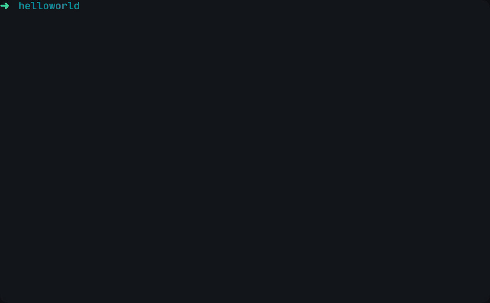

# KraftKit 🚀🐒🧰

[](https://pkg.go.dev/kraftkit.sh)

[][unikraft-discord]
[](https://goreportcard.com/report/kraftkit.sh)


KraftKit provides a suite of tools and Go-based framework for building custom, minimal, immutable lightweight unikernel virtual machines based on [Unikraft](https://unikraft.org): a fast, secure and open-source library operating system.



With KraftKit, you can easily leverage Unikraft and manage specialized, high-performance applications at every stage of their lifecycle: from construction to production.

 * [Getting started guide][kraftkit-getting-started] 📖
 * [Key differences between containers and unikernels](https://unikraft.org/docs/concepts/virtualization/) 🤔
 * [Join `#kraftkit` on Unikraft's Community Discord](https://bit.ly/UnikraftDiscord) 👾

There are many benefits in running your application as a unikernel: for more information about [the performance of unikernels 🚀](https://unikraft.org/docs/features/performance/), [the added security 🔒](https://unikraft.org/docs/features/security/) and [a positive impact on the environment 🌱](https://unikraft.org/docs/features/green/) please [check out Unikraft's documentation][unikraft-docs] and the introductory chapters on these impacts.

## Features

- 🔥 Native [Firecracker MicroVM](https://firecracker-microvm.github.io/) support;
- 📚 Pre-built unikernel app catalog;
- 🤹‍♀️ Daemonless unikernel VM instance manager;
- 📦 OCI packaging and distribution support;
- 🚜 ELF binary / POSIX-compatibility support;
- 🧰 Go SDK for building unikernels programmatically; and
- 🚀 _much more!_

## Installation

You can quickly and easily install KraftKit using the interactive installer.  Simply run the following command to get started: 

```shell
curl --proto '=https' --tlsv1.2 -sSf https://get.kraftkit.sh | sh
```

Alternatively, you can download the binaries from the [releases pages](https://github.com/unikraft/kraftkit/releases).

### Container build environment

KraftKit ships a container build environment which you can use instead of installing any dependencies directly on your host.
It includes the `kraft` binary as well as all the additional tools and libraries for building Unikraft unikernels.
Simply attach a working directory on your host as a mount path volume mapped to `/workspace`, e.g.:

```shell
docker run -it --rm -v $(pwd):/workspace --entrypoint bash kraftkit.sh/base:latest
```

The above command will drop you into a container shell.
Simply type `exit` or Ctrl+D to quit.

## Quickstart

Building a unikernel with KraftKit is designed to be simple.

Add a `Kraftfile` to your project directory, which specifies the libraries needed for your unikernel:

```yaml
specification: v0.5

unikraft: stable

libraries:
  musl: stable

targets:
  - name: default
    architecture: x86_64
    platform: qemu
```

You can also add an additional `Makefile.uk` which specifies any source files:

```Makefile
$(eval $(call addlib,apphelloworld))

APPHELLOWORLD_SRCS-y += $(APPHELLOWORLD_BASE)/main.c
```

Then it is a case of running:

```shell
cd path/to/workdir

kraft pkg update
kraft build
```

You can run your unikernel using:

```shell
kraft run
```

## Support, Community & Meetings

If you have any further questions or need more information about KraftKit or Unikraft, please refer to [the official Unikraft documentation][unikraft-docs] or ask for help on the Unikraft community forum.

A KraftKit Working Group (WG) meets every Wednesday at 12:30 PM (CET) on [Discord][unikraft-discord].
Invites and additional details are available on the [Unikraft OSS Public calendar][unikraft-calendar].

## License

KraftKit is part of the [Unikraft OSS Project][unikraft-website] and licensed under `BSD-3-Clause`.

[unikraft-website]: https://unikraft.org
[unikraft-docs]: https://unikraft.org/docs
[unikraft-discord]: https://bit.ly/UnikraftDiscord
[unikraft-calendar]: https://unikraft.org/community/events/
[kraftkit-getting-started]: https://unikraft.org/docs/getting-started/
